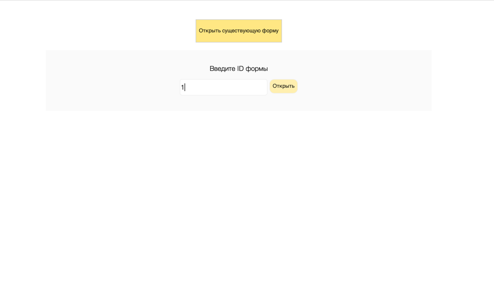
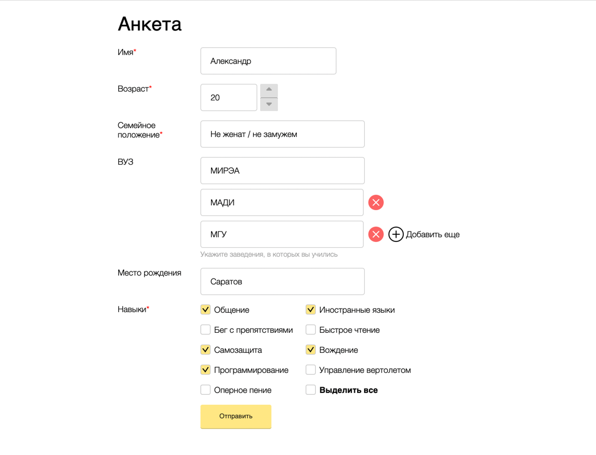

# FormGenerator
Frontend of this project was generated with [Angular CLI](https://github.com/angular/angular-cli) version 15.0.0.
Backend of this project was generated with json-server
## Run
To start the project, follow these steps:
1. download the project files
2. navigate to the root folder of the project in the terminal
3. run the following commands in terminal
    > npm install

    > npm run db
   
    > npm run start

4. open the project in the browser

## Preview

